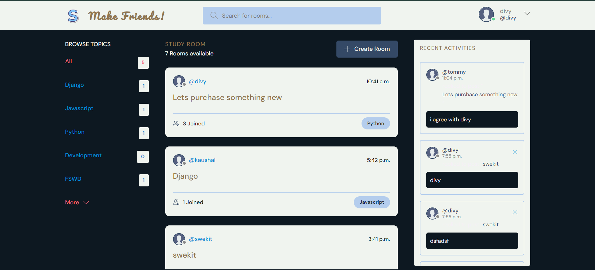
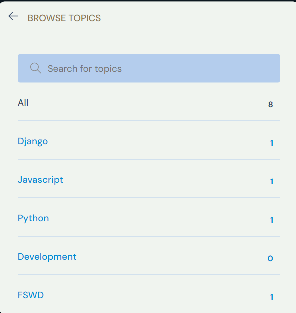
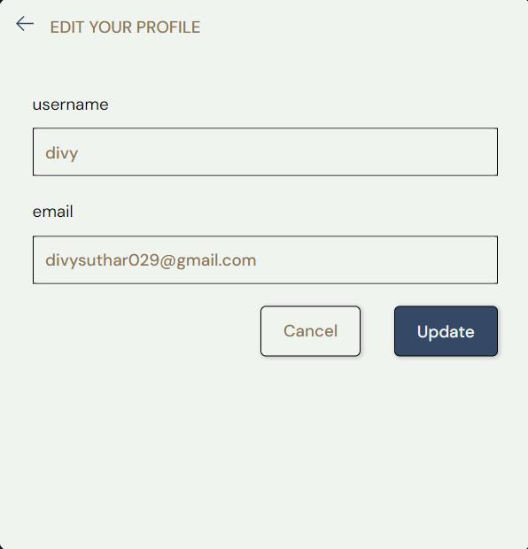
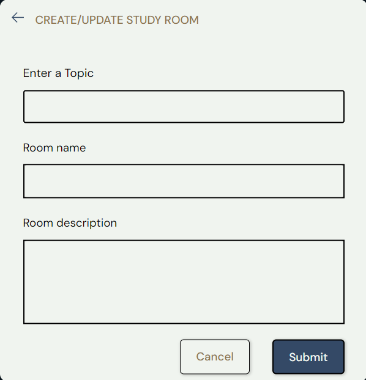

# SYNORA - Make Friends!

*SYNORA - Make Friends!* is a social platform that allows users to connect and interact through secure user authentication and intuitive message posting. The project is built using Django, Django REST Framework, HTML, Tailwind CSS, REST APIs, and Git, ensuring both a robust back-end and a smooth, engaging front-end experience.

## Features

- *User Authentication*: Secure user authentication mechanisms have been implemented to protect user data and ensure only authorized access.
  
- *Message Posting*: Users can post messages through intuitive interfaces designed for ease of use and engagement.
  
- *Django REST Framework*: The backend is powered by Django REST Framework, providing robust RESTful APIs to facilitate seamless user interactions and message communication.

- *Front-End Integration*: The front-end is fully integrated with HTML, CSS, and JavaScript, ensuring a smooth and visually appealing user experience.

## Screenshots

### Home


### Browse Topics


### Edit Profile


### Study Room


## Tech Stack

- *Backend*: Django, Django REST Framework
- *Frontend*: HTML, Tailwind CSS, JavaScript
- *API*: REST API
- *Version Control*: Git

## Installation

To get a local copy up and running, follow these simple steps:

1. **Clone the repo**
   ```bash
   git clone https://github.com/divysuthar/Social-app

## Install dependencies
   ```bash
   pip install -r requirements.txt
